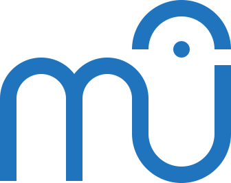

MuseScore Assets
================

This is where all assets are stored as SVG (Scalable Vector Graphics) files.
These source files are processed by various command line tools, including
[Inkscape], to produce more SVGs, as well as raster images (PNG) and icons
(ICO, ICNS) at build time. There is an option to download pre-generated assets.

[Inkscape]: https://inkscape.org/ "Inkscape open source vector graphics editor"

## Why compile assets?

Why not just commit PNG & ICO files into the repository?

- Binary files are not stored efficiently by `git`.
- The GPL requires all source files to be distributed.
- Building assets saves somebody from having to generate the files manually.
  - Reduced potential for mistakes.
  - Ensures assets match on all platforms.

## Structure

- __Resources:__ Textures and basic shapes that are used to make other assets
- __Brand:__ Logos
- __Icons:__ App icons and document filetype/mimetype icons
- __Splash:__ Splash screen images displayed at MuseScore's startup
- _Glyphs:_ in-app icons for MuseScore's buttons and menus are currently
  stored in [../mscore/data/icons](../mscore/data/icons).

## Build

The CMake build system is used to generate the assets. The build rules are
stored in `CMakeList.txt` and the `*.cmake` files.

The assets are built automatically as part of MuseScore's build, but it is
possible to build the assets separately (e.g. for testing), like this:

```bash
cd /path/to/MuseScore/assets/
mkdir build
cd build
cmake ..
make
```

## Dependencies

### Programs

The first time you run CMake you are likely to get an error message saying the
build has failed due to a missing dependency (`Not found: [name of program]`).
Simply install the required program and try again.

### Fonts

Text will not be rendered correctly unless you have the right fonts installed.
Currently, the required fonts are:

- [Raleway] (used in the splash screens)
- [Roboto] (used in the file icons and splash screens)

[Raleway]: https://fonts.google.com/specimen/Raleway
[Roboto]: https://fonts.google.com/specimen/Roboto

To avoid licensing issues, only use fonts that are open source and free. There
are free alternatives to most of the popular proprietary fonts. [Google Fonts]
is a good place to look for free fonts.

[Google Fonts]: https://fonts.google.com

## Source Files

### Input SVGs

Files in the repository must be readily editable "master files". This means:

  - Any text visible in an SVG image must be stored as editable text (i.e. not
    converted to paths).
  - Any images included in the file stored as "xlinks" to external files,
    using relative paths.

You should create and edit SVGs manually in a text editor. Do not use a
graphical SVG editing program as these add unnecessary bloat to the SVG code.
They also tend to convert simple shapes like circles to complicated Bézier
paths, making the code difficult to understand and edit later on.

However, you may use a graphical editor to help you create and edit complicated
paths, where necessary. Simply save the edited file under a different name and
then copy the relevant part of the code back into source file.

### Source rasters (PNG, JPEG, etc.)

You should avoid using raster images as source files if at all possible. If
they are necessary (e.g. as a background texture) then they should be optimized
to reduce the file size as much as possible without loss of quality and stored
in the resources folder.

- Use JPEG for photographs and textures
- Use PNG for computer generated images (e.g screenshots)

## Generated Files

### Output SVGs

Generated files must be fully self-contained (standalone). This means:

  - All text converted to paths to ensure correctness regardless of whether the
    user has the right font installed.
  - All raster images embedded into the SVG in base64 to make the file more
    portable since there is only one file to move around.
  - Formatting stored as XML attributes (`attr="val"`) rather than CSS styles
    (`style="attr:val"`) for compatibility reasons.
  - No specialist SVG syntax that is not widely supported by SVG viewers.

See [SVG Compatibility](#svg-compatibility) below.

### Output rasters (PNG, ICO, ICNS, etc.)

#### PNGs

These should be generated from the SVGs at each required size. Do not generate
a single large PNG and then scale it down as this leads to reduced quality and
increased file size. Each generated PNG should be run through `pngcrush` to
optimize the file size.

#### Icon formats (ICO, ICNS)

Icon files should be generated from separate PNG files at each required size.
Do not generate them from a single PNG (not even a large one) as this leads to
reduced quality and increased file size.

## SVG Compatibility

Support for SVG features varies widely between SVG viewer applications.
Fortunately, pretty much all viewers support a core set of features, and most
of the specialist features can be "faked" using the core set.

A good way to test compatibility is to open the file in
[Qt's example SVG Viewer][QT-svg-viewer] application. The viewer is included
with Qt and can be [loaded from the Welcome screen in Qt Creator][Qt-examples].

[QT-svg-viewer]: https://doc.qt.io/qt-5/qtsvg-svgviewer-example.html
[Qt-examples]: https://doc.qt.io/qt-5/qtexamplesandtutorials.html

Qt only supports a subset of the SVG specification called SVG Tiny, and its
implementation appears to be somewhat buggy and incomplete. SVGs that are
embedded within MuseScore's executable are displayed by Qt, so it is
essential that they are displayed correctly in the viewer.
